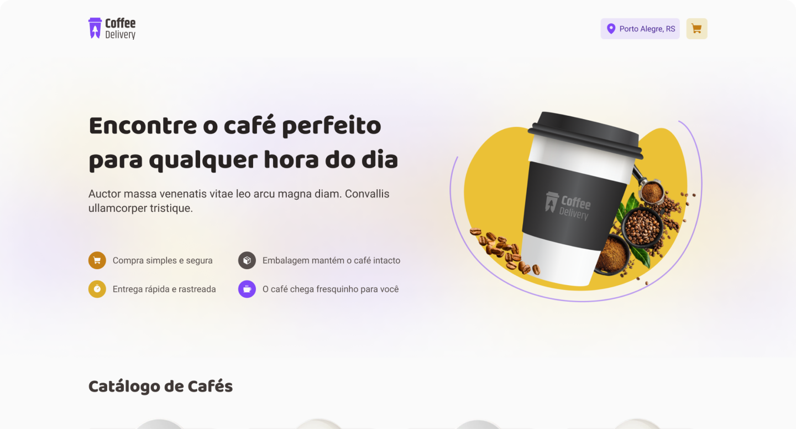

<div align="center">
  <h1>  </h1>
</div> 

<div align="center">
  <a href="#-Technologies"><b>Technologies</b></a>&nbsp;&nbsp;&nbsp;|&nbsp;&nbsp;&nbsp;
  <a href="#-Project"><b>Project</b></a>&nbsp;&nbsp;&nbsp;|&nbsp;&nbsp;&nbsp;
  <a href="#-Layout"><b>Layout</b></a>&nbsp;&nbsp;&nbsp;
</div>

<br></br>

<div align="center">
  
</div> 

<div align="center">
  
</div> 

<br></br>

## 🚀 Getting started

Clone the project and access the folder.

```bash
$ git clone https://github.com/diaspd/coffee-delivery.git
$ cd 
```

## Installation

```bash
$ npm install
```

## Running the app

```bash
$ npm run dev
```

The app will be available on `http://localhost:5173/`

<br></br>

## 💻 Technologies

This project was developed with the following technologies:
<b>
- Reactjs
- Type Script
- Java Script
- Vitejs
</b>

## 📄 Project
💰 .

<br></br>

## 🔖 Layout
- [Coffee-Delivery - Figma](https://www.figma.com/file/ZYjyFhRvDQwWvEwPgnJfmk/Coffee-Delivery-(Copy)?node-id=0%3A1&t=9BkIKZm9sxuSecvv-0)

<br></br>

Made with ♥ by Pedro Dias. 👋 Follow me on social media!<br></br>

If you can give a little star, I appreciate it 🤩
